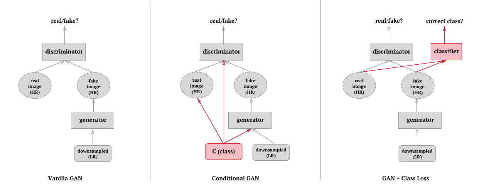

# Class-Conditional Superresolution with GANs
See [full paper](http://cs231n.stanford.edu/reports/2017/pdfs/314.pdf) here.

## Directory Structure 
See each folder's `README.md` files for more details.

### `/srez`
Experiments with original super-resolution baseline implementation.

### `/crez`
Experiments using MNIST dataset, primarily for conditional-GAN  implementation.

### `/classrez`
Experiments using celebA dataset, primarily for GAN + class loss implementation. 

#### `classrez/classifier`
Classifier trained to recognize attributes of `celebA` dataset, whose weights are saved for classifier loss model.

